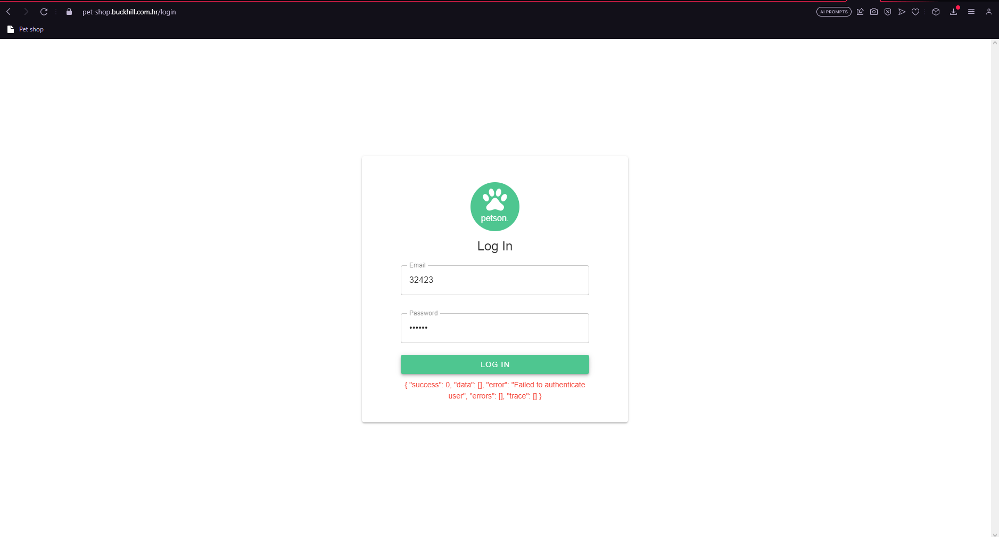
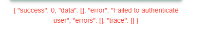

ID: 01

Title: Admin login page: Unclear error message
Environment: Windows 10 Chrome 116 
App version: -
Priority: Low
Author: Mateusz Cugier
Precoditions: 
Reproduction steps:
1. Open web app
2. Enter valid admin email into "Email" input
3. Enter invalid password into "Password" input
4. Tap "Submit" button

Actual result: Unclear error message shows up
Expected result: Clear authentication error message shows up
Attachments:

